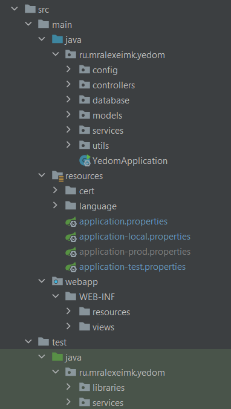

# Yedom
Yedom - образовательная онлайн-платформа

<h1>Ссылки:</h1>
<ul>
    <li>
        <a href="https://dbdesigner.page.link/Z3VkkUbzMkNAPp4f8"><b>Архитектура БД</b></a>
    </li>
    <li>
        <a href=""><b>Настройка проекта у себя</b></a>
    </li>
</ul>
<h1>Стэк:</h1>

<b>Backend</b>: Java 17, Spring Boot 2.7.4, Thymeleaf, Postgresql, Hibernate

<b>Frontend</b>: HTML5, JavaScript, Thymeleaf, Boostrap, Material kit

<h1>Документация:</h1>

<li><u>/src/main/java</u> - <b>Исходный код Backend'a</b></li>
<li><u>/src/main/webapp</u> - <b>Исходный код Frontend'a</b></li>
<li><u>/src/main/resources</u> - <b>Общие настройки проекта</b></li>
<li><u>/src/test</u> - <b>Unit тесты</b></li>

<h3>Backend:</h2>
<li><u>config/spring</u> - Конфигурация Spring</li>
<li><u>config/configs</u> - Классы конфигураций для сервисов (задаются в application.properties)</li>
<li><u>controllers</u> - Endpoint'ы</li>
<li><u>database/entities</u> - Сущности из таблиц в БД</li>
<li><u>database/repositories</u> - Репозитории для обращения к таблицам в БД</li>
<li><u>models</u> - Объекты, передающиеся на вход в модель для вставки на страницу через thymeleaf</li>
<li><u>services</u> - Микросервисы</li>
<li><u>utils/validators</u> - Валидация объектов через BindingResult</li>